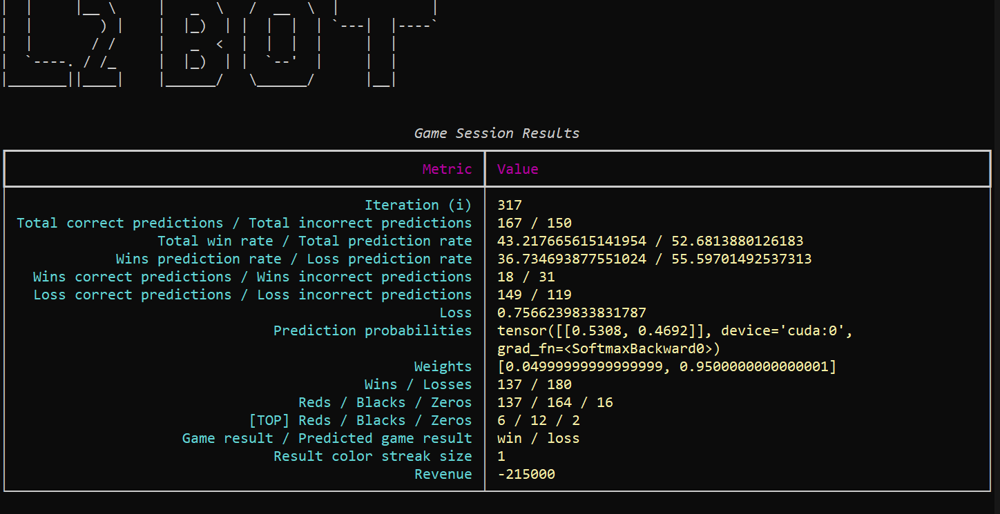

# Lineage 2 Lottery Bot

A bot designed to automate interactions and predictions for the lottery game in Lineage 2. The bot includes functionality to analyze historical game data, predict outcomes, and manage game sessions with advanced data modeling and trend analysis.

---

## Features

- **Automated Gameplay**: Simulates user interactions for lottery predictions.
- **Prediction Engine**: Analyzes past game data to predict future outcomes using trend analysis and machine learning models.
- **Dynamic Context Modeling**: Includes streak analysis, transition probabilities, and color distribution trends to refine predictions.
- **Extensive Logging**: Tracks wins, losses, and game patterns to improve bot accuracy over time.
- **File-Based Persistence**: Saves and merges game history for continuous learning.

---

## Warning

On my specific server, the lottery uses a fair random algorithm with an approximate ratio of 45-45-10 (red-black-zero), which makes predictions impossible, even with the use of a neural network. Therefore, this project is likely to be unusable on almost any L2 server unless you know the exact algorithm used as the RNG. In any case, it was a worthy attempt, so I kept the project for historical purposes — and perhaps it could be adapted for other goals in the future.

---

## Requirements

- **Operating System**: Windows
- **Python Version**: 3.8 or higher.
- **Dependencies**:
    - `torch`
    - `pyautogui`
    - `opencv-python`
    - `pickle`
    - `numpy`
    - `matplotlib`

---

## Disclaimer
This bot is for educational purposes only. Use it responsibly and ensure compliance with the terms of service of the game.

## Author and License

**Author**: Mikhail Chuloshnikov

**License**: MIT License

This library is released under the MIT License. See the [LICENSE](LICENSE) file for more details.

Let me know if you'd like to adjust or expand any part of this!